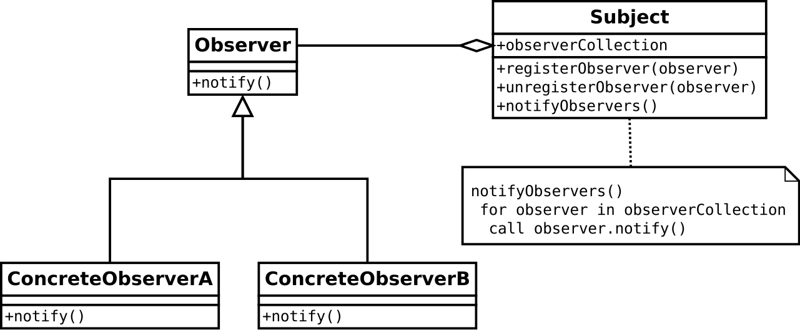
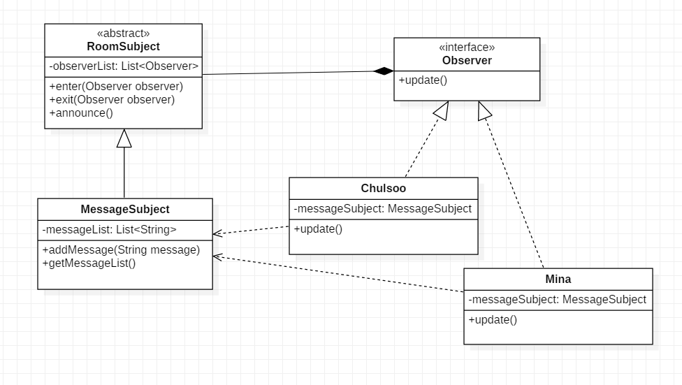
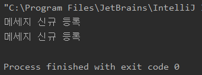

---
title: 옵저버 패턴 
date: 2020-12-11
tags:
  - DesignPattern
---  

### 1. Observer 패턴이란 ?
`Observer` 패턴은 객체의 상태변화를 관찰하는 `관찰자들(Observers)`이 어떤 객체의 상태가 변화될 때마다 메서드를 통해 등록된 `관찰자들(Observers)`에게 통지하는 디자인 패턴이다. 발행-구독 Model로도 알려져 있다.

>객체들 사이에 1:N의 의존관계를 정의해 두어, 어떤 객체가 상태가 변할 때 그 객체에 의존성을 가진 다른 객체들이 그 변화를 통지 받고 자동으로 갱신될 수 있게 만드는 패턴  
 -GOF의 디자인패턴

`관찰자(Observer)`와 관찰자에게 어떤 객체의 상태변화에 대해 통보하는 역할을 하는 `주체(Subject)`가 있다. 

`관찰자`는 `주체`의 상태 변화가 있을 때마다 통보를 받는다.

예제로 생각해보면, 우리가 흔히 사용하고 있는 카카오톡 단톡방에서 누군가 Message를 전송하면 Push 데이터로 나의 핸드폰에 발송된다. 여기서 이 Message 전송을 단톡방에 참여한 모든 사람이 가능한 것이 아니라 방장만 가능하다고 가정해보자. (쉬운예제를 위해)  
 그럼 단톡방에서 발생된 Message를 항상 `감시하고 관찰`하는 대상인 객체는 **단톡방에 참여한 사람**들이 `관찰자(Observer)`에 해당되며, 방장이 Message를 발송함으로써 단톡방의 상태가 새로운 Message가 쌓여 변경되어 모든 관찰자에게 알리는 역할을 함으로써 단톡방이 `주체(Subject)`가 된다고 할 수 있다.

 ~~~java
public interface Observer {
    void update();
}

public class Mina implements Observer {

    private MessageSubject messageSubject;

    public Mina(MessageSubject messageSubject) {
        this.messageSubject = messageSubject;
    }

    @Override
    public void update() {
        List<String> messages = messageSubject.getMessageList();
        messages.stream().forEach(o->System.out.println(o));
    }

}

public class ChulSoo implements Observer {

    private MessageSubject subject;

    public ChulSoo(MessageSubject subject){
       this.subject = subject;
    }

    @Override
    public void update() {
        List<String> messages = subject.getMessageList();
        messages.stream().forEach(o->System.out.println(o));
    }
}
 ~~~

철수와 미나라는 `관찰자(Observer)` 객체가 있으며, 이 각 `관찰자 객체`는 `메세지`라는 상태 자료구조를 필드값으로 가지고 있다. 

~~~java

public abstract class RoomSubject {

    private List<Observer> observerList = new ArrayList<>();

    //관찰자(Observer)를 추가
    public void enter(Observer observer) {
        observerList.add(observer);
    }

    //관찰자(Observer)를 제거
    public void exit(Observer observer) {
        observerList.remove(observer);
    }

    //방에 입장한 모든 유저(관찰자)에게 상태변경을 통지
    public void announce() {
        observerList.forEach(Observer::update);
    }
}

public class MessageSubject extends Subject {

    private List<String> messageList = new ArrayList<>();

    //새로운 메세지가 등록이 되면, 모든 감시자들에게 상태변화를 알린다.
    public void addMessage(String message){
        messageList.add(message);
        announce();
    }

    public List<String> getMessageList(){
        return messageList;
    }
}

~~~
`RoomSubject`는 `관찰자`인 단톡방 참여자들를 **관리하는 클래스**이다. `RoomSubject`를 상속받은 `MessageSubject`는 Room(단톡방) 내에 **Message의 상태 자료구조**를 담당하는 클래스이다. MessageSubject의 자료구조가 변경될 때마다 부모클래스인 RoomSubject에게 전달하고 RoomSubject는 자신이 관리하고 있는 관찰자들에게 데이터값이 변경되었다는 것을 통지하게 된다.  

`Subject(주체)`클래스에 대한 구체적인 상태값에 대한 클래스는 자식 클래스로 구현함으로써 Message뿐만아니라 기타 다양한 상태값을 `Observer(관찰자)`에게 전달할 수 있다. 

~~~java

public class Client {
    public static void main(String[] args) {
        MessageSubject messageSubject = new MessageSubject();

        ChulSoo chulSoo = new ChulSoo(messageSubject);
        Mina mina = new Mina(messageSubject);

        messageSubject.enter(chulSoo);
        messageSubject.enter(mina);

        messageSubject.addMessage("메세지 신규 등록");
    }
}
~~~

[실습예제링크](https://github.com/dhkdhk/DesginPattern/tree/master/src/observer)

[Refference]
- GOF의 디자인 패턴
- https://gmlwjd9405.github.io/2018/07/08/observer-pattern.html