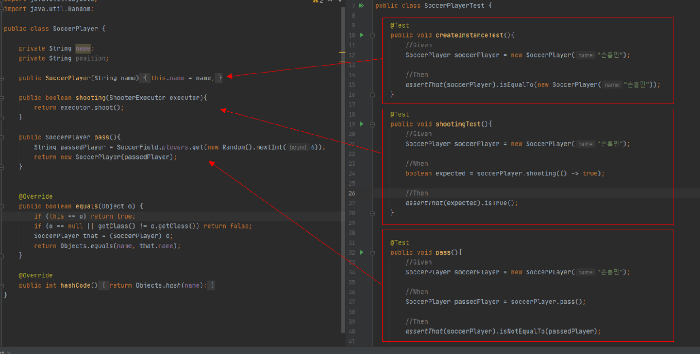

---
title: 테스트코드의 장점
date: 2021-01-03
tags:
  - CleanCode
  - Test
---  
 Next Step의 Clean Code,TDD 강의 미션들을 진행하면서 테스트와 도메인 모델, 그리고 클린코드에 대해서 많이 생각해 볼 수 있게 되었다.

 특히나 이전에는 인터넷에서 테스트코드에 대한 중요성 혹은 필요성과 관련된 글들을 읽으면서
 대략 머리로만 얕게 이해했다고 착각하고 넘어갔던 부분들이 있었는데,
 이 강의 미션들을 수행하면서 경험을 통해 테스트코드에 대한 `필요성`과 단위 테스트를 잘게
 쪼개어 클린코드들을 만들어가는 과정을 익힐 수 있었다. 

 그래서 이번 글은 테스트코드와 관련하여 간단하게 정리하고자 한다. 

  
 ##### 1. 테스트코드는 독립적인 환경을 제공해준다. 

  보통 테스트코드가 없이 개발을 진행하면, 개발 후 테스트 확인을 위하여 전체 어플리케이션을 띄우고
  확인을 하게 된다. UI에 인풋값을 넣고 아웃풋을 확인하는 방식은 테스트 시간이 꽤나 길게 될 뿐더러
  생각했던 테스트 대상에 대한 개발범위보다 더 넓은 부분을 의도치 않게 개발을 어느정도 완성을 해야 
  테스트가 가능해지게 된다. 

  

  첫번째 독립적이지 못한 테스트 환경은 테스트 대상을 테스트 하기 위하여 다른 프로세스 과정을 거쳐야만 진행해야한다. 이렇게
  진행하면 할 수록 개발이 더욱 길어지고 생산성 또한 낮아지게 된다. 반면 독립적인 테스트 환경을 갖추게 될 경우, 테스트하고자
  하는 대상에만 집중하여 테스트를 진행할 수 있기 때문에 더 견고하고 빠른 개발이 가능하다.

  간단한 예제로, 축구선수에 대한 도메인 테스트를 수행하는 과정을 살펴보겠다. 
  

  SoccerPlayer라는 클래스에 대해서만 독립적인 실행환경을 갖춘 테스트 코드이다. 이렇게 다른 기능에 대한 개발없이, 
  테스트하고자 하는 도메인에만 집중하여 테스트를 진행 할 수 있다. 
  더 작게는 해당 도메인 내부에 있는 메서드에 대한 테스트를 진행할 수 있다.

 ##### 2. 관계가 얽힌 클래스간 높은 의존성을 찾을 수 있다. 
  테스트 대상은 작을 수록 좋았다. 테스트 대상이 작으면, 사전셋팅을 해야하는 코드량도 상대적으로 적었었다. 이런 경우 객체간의
  의존성이 낮기 때문이라고 본다. 

  그래서 테스트 코드를 작성하다보면 Given, When, Then으로 이어지는 시나리오에 Given영역에서 여러 객체를 셋팅해야할 경우가 있다. 
  이럴 경우 객체간의 높은 의존성을 한번 의심해봐야한다.

  ~~~java
  //아주 심플한 간단한 예시
  //Given
  Sport sport = new Sport(new Soccer(new Player(new Name("Player"))))
  ~~~

  아주 간단한 예시지만, 해당 수업 미션을 진행하면서 Given영역에 대한 코드작성이 너무 번거롭다는 생각이 들어
  클래스간 의존도를 낮추기 위하여 리팩토링을 통해 쉬운 테스트코드로 변경한적이 있었다. 

  이렇듯 테스트 코드를 통해 문제가 될 수 있는 요지 혹은 개선이 필요한 코드들을 파악 할 수 있으며, 실제로 개선할 때도 
  테스트 중심으로 개선작업이 진행되기 때문에 부담이 덜 가게된다. 

 ##### 3. 정리

이전에는 테스트코드를 거의 작성안했었다. 단순히 인터넷 글들만 보고 아~ 우선쓰면 좋은거구나~라고만 생각이 들었었는데
이번 교육을 통해서 피부로 직접 느끼면서 확실한 필요성과 편리함을 느꼈다. 

또한, 교육명이 CleanCode, TDD 이 두 용어를 처음에는 서로 개별적인 의미로 생각을 했었다. 지금 생각해보면 TDD 혹은 테스트코드를
통해 클린코드를 만들어나아갈 수 있어 개별적인 의미가 아닌 시너지가 더한 의미라는 생각이 든다. 

 
  

