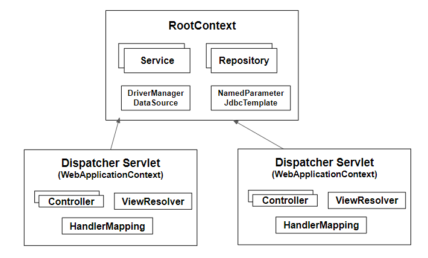

---
title: 코드기반 Spring 설정(1)
date: 2019-11-29
description: 코드 기반 Spring 설정
tags:
  - Spring
---  
 
 기존에는 xml방식으로 Spring 프로젝트를 만들었다. 익숙한 xml 설정은 대략적인 흐름도에 대한 이해만 있었고, 
 그 내부에 어떤 식으로 환경들을 구성하고 조립되는지에 대해 더 깊은 고민은 해보지 않았던 것 같았다.

이번 Java Code로 Spring 설정을 통해 Spring의 ServletContext 구조에 대해 조금 더 이해하기 위하여 실습을 통해
내용을 정리하였다. 

#### 1. RootApplicationContext / WebApplicationContext

 Java 코드로 Spring을 설정하기 전에 먼저 이해해야하는 부분은 RootApplicationContext와 WebApplicationContext이다. 
 Spring의 ApplicationContext를 계층적으로 분리하여 Root(부모)와 Web(자식)으로 나눈 ApplicationContext를 말한다.(일종의 상속구조?)

 

위의 그림처럼 여러 개의 WebApplicationContext들은 단 하나의 RootApplicationContext에서 설정된 Bean들을 공유하여 사용한다. 
Spring에서는 왜 이렇게 하나의 Root와 여러개의 Web ApplicationContext를 만들 수 있도록 제공하였을까?
당연히 확장성 때문이다. 각 레이어간의 책임 및 역할을 생각해보면, 왜 그림과 같은 구조로 만들었는지 어느정도 이해할 수 있었다.

일반적으로 Java WebApplication 구조는 클라이언트에 UI 랜더링, 컴포넌트를 처리하는 Presentation Layer, 
비즈니스 로직을 처리하는 Business Layer, Database에 접근하는 Data Access Layer로 구성되어 있다. 

여기서 RootApplicationContext는 Business Layer와 Data Access Layer에 필요한 Bean 생성과 관계설정등에 대한 설정 내용을 담고 있고, 
WebApplicationContext는 Presentation Layer인 SpringMVC와 관련된 설정 내용을 담고 있다.

 데이터의 처리와 정합성, 트랜잭션의 일관성 등을 유지해야하는 Business Layer, Data Access Layer를 굳이 두개를 만들어 중복이 허용되도록 할 필요는 없을 것 같다.
상대적으로 클라이언트와 가장 밀접한 Presentation Layer는 다양한 클라이언트에 필요한 부분을 맞춰줘야하기 때문에 WebApplicationContext를 
여러개를 두지 않았나라는 생각이 든다.

##### 2. ServletContext 설정
Servlet 3.0 이상부터는 xml대신 Java 코드로 Web과 관련된 설정이 가능하다. 
Spring에서는 web 설정을 지원 해줄 수 있는 몇 개의 인터페이스를 제공한다. 그 중에서 좀 더 Servlet 설정에 직관적으로 보이는 WebApplicationInitializer를 선택하였다.

~~~java
public class ServletInitConfig implements WebApplicationInitializer {
 
     @Override
     public void onStartup(ServletContext container) {
 
         //① RootApplicationContext 생성 및 설정정보 등록
         AnnotationConfigWebApplicationContext rootContext = new AnnotationConfigWebApplicationContext();
         rootContext.register(RootAppConfig.class);
 
         //② RootApplicationContext 라이프사이클 설정
         container.addListener(new ContextLoaderListener(rootContext));
 
         //③ WebApplicationContext 생성 및 설정정보 등록
         AnnotationConfigWebApplicationContext dispatcherContext = new AnnotationConfigWebApplicationContext();
         dispatcherContext.register(WebAppConfig.class);
 
         //④ DispatcherServlet 생성 및 기타 옵션정보 설정
         ServletRegistration.Dynamic dispatcher = container.addServlet("dispatcher", new DispatcherServlet(dispatcherContext));
         dispatcher.setLoadOnStartup(1);
         dispatcher.addMapping("/");
        
     }
}
~~~

### [Refference]