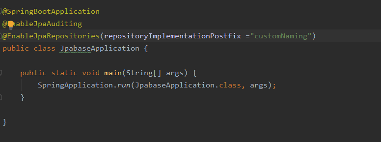
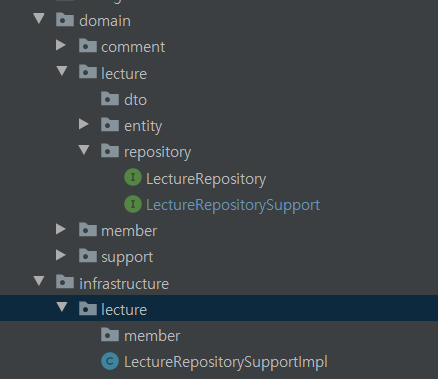
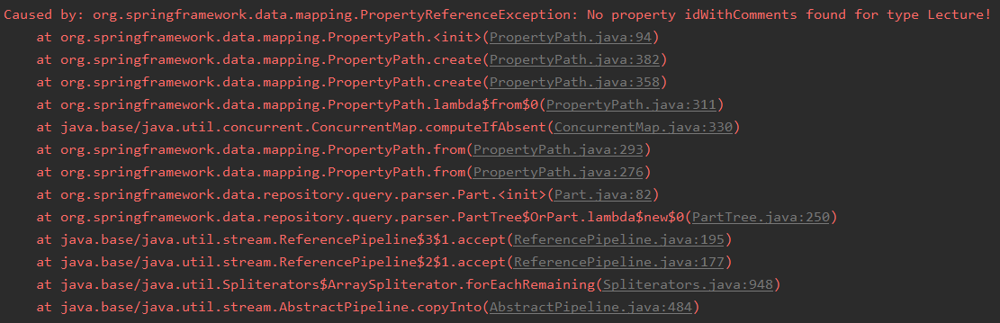
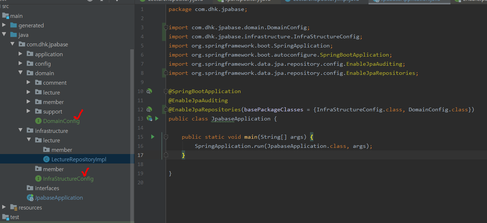

---
title: Spring Data JPA, 커스텀 리포지토리
date: 2020-03-22
description: Java에서의 객체 직렬화에 대해 정리한 글
tags:
  - JPA
---  

Spring Jpa Data의 JpaRepository와 결합된 커스텀 리포지토리를 만드는 방법과 직접 구현해보면서 마주했던 문제들에 대해 정리한다. 

### 1. 커스텀 리포지토리
보통 Spring Data Jpa 사용할 경우 JpaRepository를 상속받아서 사용한다.Spring Data Jpa가 제공하는 쿼리메서드 이외에도 커스텀한 리포지토리를 추가하고 싶을 경우, 
사용자가 직접 쿼리메서드를 만들어서 사용할 때가 필요하다.
 

위의 클래스다이어그램 처럼 하나의 커스텀 리포지토리 인터페이스를 만들고 그 인터페이스를 구현한 구현체 클래스를 만든다. 
그리고 기존 xxxRepository(여기서는 DomainRepository)가 JpaRepository와 DomainRepositoryCustom을 상속받으면 Service 레이어에서는 
DomainRepository만 사용하여 이용할 수 있게 된다.

### 2. 규칙 
커스텀 리포지토리를 만들 때에는 네이밍 규칙이 따른다. 

 - Postfix   
: 커스텀 리포지토리를 구현한 구현체 클래스에 `후위표기식`으로 `Impl`을 붙여줘야 한다는 것이다.  
 
 - 커스텀 구현체 클래스 네이밍  
 : 위의 사진을 보면, 커스텀 리포지토리 구현체인 `DomainRepositoryImpl`로 되어있다. 구현대상인 `DomainRepositoryCustom`가 아닌 기존 JpaRepository를 상속한 
 `DomainRepository` 네이밍에 postfix로 `Impl`을 사용 해야한다.

이러한 네임 스페이스 기준으로 Spring Data Jpa가 빈으로 등록될 때 `해당 패키지 이하`를 자동 검색하여 `query method`로 사용할 수 있기 때문이다. 

여기서 `Impl`은 Default이며 사용자가 후위표기식에 대해 커스텀하게 만들고 싶을 경우, 별도의 설정이 필요하다.

`@EnableJpaRepositories` 어노테이션 속성인 `repositoryImplementationPostfix`를 사용하여 커스텀하게 구성 할 수 있다.

### 2. 실습해보면서 마주했던 이슈들

 미니 프로젝트에 적용하면서 패키지 경로와 관련하여 약 2일동안 해맸었다. 이 문제는 공식문서 내용만 꼼꼼히 읽었으면 쉽게 해결할 수 있는 문제였다

CustomRepository를 생성 후에 처음에는 다른 패키지에 클래스를 두었다. 

이런식으로 하다보니 Spring Data Jpa에서 CustomRepository의 쿼리 메서드를 찾지못하여 noproperty라는 exception이 발생한다.

위의 문제는 repository 패키지 이하에 커스텀 리포지토리 구현체를 둘 경우 쉽게 해결되긴 하지만,
DDD 관련책을 읽으면서 계층별로 분리하고 싶은 마음에 위와 같은 구조로 두었었다.  Bean 스캔을 커스텀하게 두고 싶은 경우 아래와 같이 변경해주면 된다. 

이렇게 `마커 인터페이스`를 둠으로써 패키지 스캔 기준을 잡고, `@EnableRepositories`에 basePackageClasses을 등록해주면 패키지 스캔을 할 수 있다. 