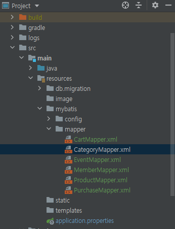
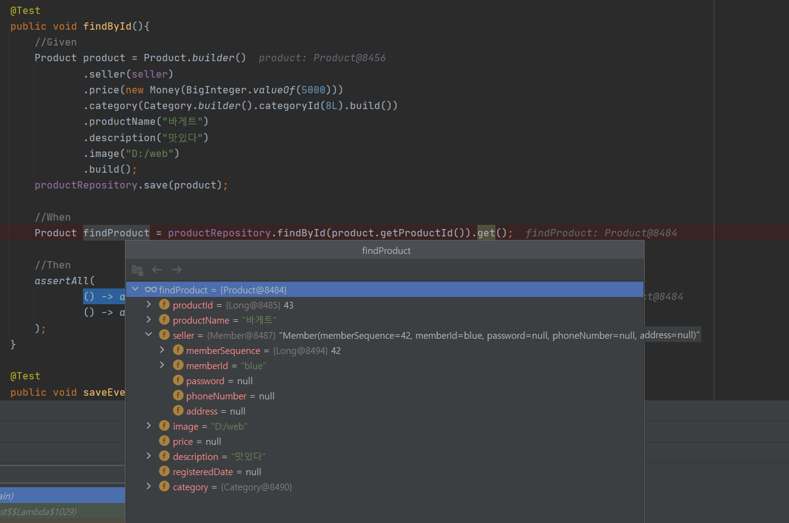
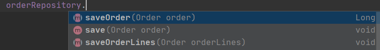
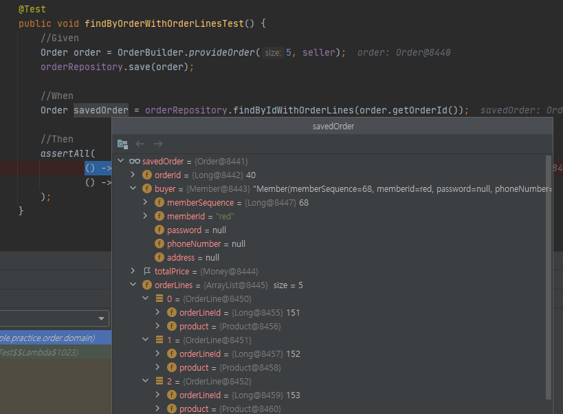
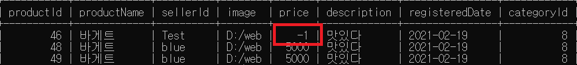

---
title: Mybatis 연관관계 맵핑 
date: 2021-03-01
tags:
  - Mybatis
  - SpringBoot
---  

SpringBoot-Mybatis 프로젝트 환경에서 제공해주는 기본옵션들과 
Mybatis에서 제공하는 연관관계 맵핑과 관련하여 정리하였다. 

전체 소스코드는 [깃허브주소](https://github.com/DongHwani/base-springboot-mybatis)에서 확인할 수 있다

##### 1. 프로젝트 의존성 설정 

~~~gradle
dependencies {
 implementation 'org.mybatis.spring.boot:mybatis-spring-boot-starter:2.1.4'
}
~~~
이렇게 의존성을 추가하면 스프링부트에서는 오토 스캐닝을 지원하여 `Mapper 인터페이스`(어노테이션)를 찾아
Bean으로 등록해준다. 
 
##### 2. Mapper 설정

Mapper 설정에는 총 2가지 파일 생성이 필요하다. 첫번째는 xml기반의 쿼리문, 객체 맵핑등을 기술한 xml파일과 이 xml파일의 기능들을
제공하기 위한 인터페이스 생성이다. 

2-1) 스프링 컨테이너에 등록할 Repository 생성
~~~java
@Mapper
public interface CategoryRepository {

    void save(Category category);
}
~~~
@Mapper 어노테이션이 붙어있으면 해당 인터페이스는 스프링 컨테이너에 bean으로 등록된다.

2-2) mapper.xml 생성   

~~~xml
<?xml version="1.0" encoding="UTF-8"?>
<!DOCTYPE mapper PUBLIC "-//mybatis.org//DTD Mapper 3.0//EN"
        "http://mybatis.org/dtd/mybatis-3-mapper.dtd">

<mapper namespace="com.example.practice.category.domain.CategoryRepository">

    <insert id="save" parameterType="category"
            useGeneratedKeys="true"  keyProperty="categoryId" >
      INSERT INTO categories
        (categoryCode, categoryName)
      VALUES
        (#{categoryCode}, #{categoryName})
    </insert>
</mapper>
~~~
두 개의 파일을 프로젝트에 생성하였다면, 두 개의 파일을 이어줄 수 있는 `경로설정`이 필요하다. 왜냐하면
인터페이스를 통해 해당 xml의 쿼리문을 수행해야하는데 이 mapper 인터페이스가 xml 파일위치가 어디에 있는지 알 수 없기 
때문이다.   

2-3)properties 파일에 mapper 경로설정
~~~properties
mybatis.mapper-locations=mybatis/mapper/*.xml
~~~
이렇게 경로에 대한 설정을 해주면, mapper 인터페이스가 해당 xml을 찾아서 요청하여 mybatis를 사용하게 된다.
기본적으로 mapper-locations는 루트구조가 resources폴더로 되어있기에 resources폴더 하위에 mapper 폴더 경로를 적어주면된다.

이렇게 mapper xml 경로를 설정을 완료하였다면 mapper 인터페이스에서 xml를 사용할 수 있게 된다. 여기서 mapper 인터페이스에
기술된 메서드명과 xml에 쿼리문에 기술된 id값이 일치해야 해당 쿼리문을 수행 할 수 있다.

##### 3. 연관관계 맵핑

3.1) has one 관계   
has one 관계인 객체로 맵핑할 경우 `<association>` 태그를 사용하여 맵핑 할 수 있다.   
~~~java
public class Product {
	
	private Long productId;
	private String productName;
	private Member seller;
	private String image;
	private Money price;
	private String description;
	private LocalDateTime registeredDate;
	private Category category;
    
    //생략.. 
}
public class Member {

    private Long memberSequence;
    private String memberId;
    private String password;
    private String phoneNumber;

}
~~~ 
~~~sql
CREATE TABLE `practice`.`members` (

  `memberSequence`     BIGINT(20)          NOT NULL AUTO_INCREMENT COMMENT '유저 번호',
  `memberId`          VARCHAR(150)         NOT NULL                COMMENT '유저 ID',
  `password`          VARCHAR(150)         NOT NULL                COMMENT '유저 패스워드',
  `phoneNumber`       VARCHAR(150)         NOT NULL                COMMENT '유저 전화번호',
  `address`           VARCHAR(300)         NOT NULL                COMMENT '유저 주소',
  `detailAddress`     VARCHAR(300)         NOT NULL                COMMENT '유저 주소',
  `zipCode`           VARCHAR(50)          NOT NULL                COMMENT '유저 주소',

  PRIMARY KEY (`memberSequence`));

CREATE TABLE `practice`.`products` (

  `productId`       BIGINT(20)    NOT NULL AUTO_INCREMENT COMMENT '상품 번호',
  `productName`     VARCHAR(150)  NOT NULL                COMMENT '상품 이름',
  `sellerId`        VARCHAR(100)  NOT NULL                COMMENT '작성자',
  `image`           VARCHAR(200)  NOT NULL                COMMENT '상품 이미지',
  `price`           BIGINT        NOT NULL                COMMENT '상품가격',
  `description`     VARCHAR(500)  NOT NULL                COMMENT '상품설명',
  `registeredDate`  DATE          NOT NULL                COMMENT '등록일자',
  `categoryId`      BIGINT(20)    NOT NULL                COMMENT '카테고리 번호',

  PRIMARY KEY (`productId`));
~~~
상품을 의미하는 Product 클래스는 판매자를 의미하는 Member 클래스를 값 타입으로 가지고 있다. Product 클래스에 값들을 맵핑시키려면 products 테이블과
members 테이블을 JOIN한 결과값을 Product 클래스에 맵핑하면 된다. 
~~~xml
<?xml version="1.0" encoding="UTF-8"?>
<!DOCTYPE mapper PUBLIC "-//mybatis.org//DTD Mapper 3.0//EN"
        "http://mybatis.org/dtd/mybatis-3-mapper.dtd">

<mapper namespace="com.example.practice.product.domain.ProductRepository">

    <resultMap id="Product" type="com.example.practice.product.domain.Product">
        <id property="productId"       column="productId"/>
        <result property="productName" column="productName"/>
        <result property="image" column="image"/>
        <result property="description" column="description"/>
        <result property="registeredDate" column="registeredDate"/>
        <association property="seller"         javaType="com.example.practice.member.domain.Member">
            <id property="memberSequence"       column="memberSequence"/>
            <result property="memberId"         column="memberId"/>
        </association>
    </resultMap>

    <select id="findById" parameterType="long" resultMap="Product">
        SELECT
            p.productId,
            p.productName,
            p.image,
            p.description,
            p.categoryId,
            m.memberSequence,
            m.memberId
        FROM products p INNER JOIN members m
        ON p.sellerId = m.memberId
        WHERE p.productId = #{productId}
    </select>

</mapper>
~~~

<테스트결과>

3-2) has many 관계(one to many)
 one to many의 관계에서는 insert와 select 두 가지 과정에 대해 살펴보겠다.  
      
 - **INSERT 과정**   
~~~java
public class Order {

    private Long orderId;
    private Member buyer;
    private Money totalPrice;
    private List<OrderLine> orderLines;

    public int countOrderLines() {
        return orderLines.size();
    }
    //생략...
}
public class OrderLine {

    private Long orderLineId;
    private Product product;

}

~~~
~~~sql
CREATE TABLE `practice`.`orders` (

  `orderId`          BIGINT(20)    NOT NULL AUTO_INCREMENT COMMENT '구매 번호',
  `memberId`         VARCHAR(150)  NOT NULL                COMMENT '구매자',
  `totalPrice`       BIGINT(20)    NOT NULL                COMMENT '구매 총 금액',

  PRIMARY KEY (`orderId`)
);

CREATE TABLE `practice`.`order_lines` (

  `orderLineId`      BIGINT(20)    NOT NULL AUTO_INCREMENT COMMENT '구매목록 번호',
  `orderId`          BIGINT(20)    NOT NULL                COMMENT '구매 번호',
  `productId`        BIGINT(20)     NOT NULL                COMMENT '구매자',

  PRIMARY KEY (`orderLineId`)
);
~~~
주문을 의미하는 Order는 1개 이상의 상품을 구매 할 수 있다. 하나의 주문은  여러개의 주문상품을 가질 수 있기때문에 one to many의 관계를 가진다. 
여기서 새로운 order가 insert 될 경우, 주문을 의미하는 orders 테이블에 저장이 되야하며, 해당 주문에 포함되어있는 상품목록들을 order_lines 테이블에 저장해야한다.

~~~java
@Mapper
@Repository
public interface OrderRepository  {
    Long saveOrder(Order order);
    void saveOrderLines(Order order);
}
~~~
~~~xml
    <insert id="saveOrder" parameterType="com.example.practice.order.domain.Order"
            useGeneratedKeys="true"  keyProperty="orderId" >
      INSERT INTO orders
        (orderId, memberId, totalPrice)
      VALUES
        (#{orderId}, #{buyer.memberId}, #{totalPrice.price})
    </insert>

    <insert id="saveOrderLines" parameterType="order">
        INSERT INTO order_lines
            (orderId, productId)
        VALUES
            <foreach collection="orderLines" item="orderLine" open="(" separator="),(" close=")">
                #{orderId}, #{orderLine.product.productId}
            </foreach>
    </insert>
~~~
이렇게 OrderRepository에 order를 insert하는 메서드와 주문목록인 orderLines를 insert를 하는 메서드 두 개를 만들어 테이블에 저장할 수 있다.
하지만, 이런 일반적인 방법은 객체의 연관관계가 아닌 테이블의 연관관계에 따라 Repository를 사용하는 쪽에서 좀 더 구체적인 테이블 정보를 알아야하는 불편함이 있다.
~~~java
 public class OrderRepositoryTest  {
    @Autowired
    private OrderRepository orderRepository;

    public void save() {
        //OrderRepository를 사용하는 쪽에서 두 개의 메서드를 사용해야 정상적으로 두 테이블에 데이터가 저장된다.
        //순서 또한 지켜줘야한다는 불편함이 있다.
        orderRepository.saveOrder(order);
        orderRepository.saveOrderLines(order);
    }
}
~~~

JPA처럼 루트 도메인격인 Order 객체를 insert하면 연관관계에 있는 하위 도메인도 insert를 하여 좀 더 추상화 될 수 있는 방법이 없을까 고민하다가
스택오버플로우에서 default 메서드를 사용하여 제공해주는 방법을 찾았다. 
~~~java 
@Mapper
@Repository
public interface OrderRepository extends OrderBaseSave {

    Long saveOrder(Order order);
    void saveOrderLines(Order order);
    
    default void save(Order order) {
        saveOrder(order);
        saveOrderLines(order);
    }
}
~~~
(출처 : https://stackoverflow.com/questions/33028923/mybatis-inserts-one-to-many-relationship)

이렇게 하면 사용하는 쪽에서 save 메서드만 사용해도 두 테이블에 저장할 수 있게 된다. 
~~~java
 public class OrderRepositoryTest  {
    @Autowired
    private OrderRepository orderRepository;

    public void save() {
        //이런 방법도 있었구나 
        orderRepository.save(order);
    }
}
~~~
하지만 saveOrder, saveOrderLines 두 개 메서드가 여전히 공개된 상태이기 때문에 사용하는 쪽에서 해당 메서드를 사용 할 문제가 있다. 

이 두 개의 메서드를 save라는 하나의 메서드로 사용하는 쪽에 제공하려면, 상속 구조를 사용하면 된다. 
~~~java 
public interface OrderBaseSave {

    Long saveOrder(Order order);
    void saveOrderLines(Order orderLines);

}

@Mapper
@Repository
public interface OrderRepository extends OrderBaseSave {

    default void save(Order order) {
        saveOrder(order);
        saveOrderLines(order);
    }
}
~~~
이 방법으로 Repository를 사용하는 쪽에서는 테이블의 연관관계에 상관없이 save 메서드만 사용해서 객체와 연관된 객체들도 저장할 수 있게 된다.   

 - **SELECT 과정**  
 one to many의 조회 결과는 테이블간의 Join 쿼리로 결과값에 대해 `<collection>` 태그를 사용하여 객체에 맵핑 할 수 있다.
~~~xml
<mapper namespace="com.example.practice.order.domain.OrderRepository">
   <resultMap id="order" type="order">
        <id property="orderId"                  column="orderId"/>
        <association property="buyer"           javaType="com.example.practice.member.domain.Member">
            <id property="memberSequence"       column="memberSequence"/>
            <result property="memberId"         column="buyerId"/>
        </association>
        <association property="totalPrice" resultMap="money" />
        <collection property="orderLines" ofType="com.example.practice.order.domain.OrderLine">
                <id property="orderLineId"          column="orderLineId"/>
                <association property="product"     javaType="product">
                    <id property="productId"        column="productId"/>
                    <result property="productName"  column="productName"/>
                </association>
        </collection>
    </resultMap>

    <resultMap id="money" type="com.example.practice.product.domain.Money">
        <constructor>
            <arg  column="totalPrice" javaType="java.math.BigInteger" ></arg>
        </constructor>
    </resultMap>

    <select id="findByIdWithOrderLines" parameterType="java.lang.Long" resultMap="order">
        SELECT
            o.orderId,
            o.totalPrice,
            m.memberSequence,
            m.memberId AS buyerId,
            l.orderLineId,
            p.productId,
            p.productName
        FROM orders o
            INNER JOIN members m ON o.memberId = m.memberId
            INNER JOIN order_lines l ON o.orderId = l.orderId
            INNER JOIN products p ON l.productId = p.productId
        WHERE
           o.orderId = #{orderId}
    </select>
</mapper>
~~~
`<collection>` 태그의 `ofType`의 속성은 제네릭을 의미한다. `List<OrderLine>`의 형태이기 때문에 ofType에는 OrderLine 클래스를 입력하였다. 
~~~java
public class OrderRepositoryTest {
    @Test
    public void findByOrderWithOrderLinesTest() {
        //Given
        Order order = OrderBuilder.provideOrder(5, seller);
        orderRepository.save(order);

        //When
        Order savedOrder = orderRepository.findByIdWithOrderLines(order.getOrderId());

        //Then
        assertAll(
                () -> assertThat(order).isEqualTo(savedOrder),
                () -> assertThat(order.countOrderLines()).isEqualTo(savedOrder.countOrderLines())
        );
    }
}
~~~
<테스트 결과>

 orderLines 필드에 값들이 잘 들어온 걸 확인 할 수 있다. 

3-3) 생성자를 통한 객체 맵핑  
Product 객체 내부에는 Money라는 객체가 있다. 
이 Money 객체는 양수의 값만 받을 수 있도록 생성자에 제약사항을 걸어놨다. 
(Java bean 규약에 따르는 기본생성자가 있어야 Mapping이 가능하여 private 생성자를 추가하였다 )
~~~java
public class Product {
	
	private Long productId;
	private String productName;
	private Money price;
    // 생략..
}

public class Money {

	private static final int NEGATIVE_OR_ZERO = 1;
	private BigInteger price;

	private Money(){}

	public Money(final BigInteger price) {
		if (price.signum() != NEGATIVE_OR_ZERO) {
			throw new InvalidMoneyPriceException();
		}
		this.price = price;
	}

	public BigInteger getPrice() {
		return price;
    }
}
~~~
DB에서 조회 후 해당 값을 Money 객체의 생성자 파라미터로 넘겨주려면 `<constructor>`태그를 사용하여
인스턴스 생성시에 조회 된 결과값을 파라미터로 넘겨줄 수 있다. 
~~~xml
    <resultMap id="Product" type="com.example.practice.product.domain.Product">
        <id property="productId"       column="productId"/>
        <result property="productName" column="productName"/>
        <association property="price"  javaType="com.example.practice.product.domain.Money">
           <constructor>
              <arg  column="price" javaType="java.math.BigInteger" ></arg>
           </constructor>
        </association>
        <!-- 생략 -->
    </resultMap>
~~~
`<arg>`태그를 사용하여 Mapping된 결과값을 생성자 파라미터로 넘겨주면, Money 객체 생성자에 있는 음수값에 대한 유효성검사
를 거치게된다. 

만약 데이터베이스에 강제로 실수로 음수값을 insert했다고 가정해보겠다. 

가격이 -1인 상품은 도메인 규칙에 어긋난다. 위의 생성자 태그를 사용하여 가격이 -1인 상품을 가져 올 경우 리플렉션 과정 중 
도메인 예외가 발생하여 사전에 불필요한 값을 가져오지 못하도록 미연의 방지를 할 수 있게 된다. 
~~~java
public class ProductRepositoryTest extends ProductDomainBuilder {
    @Test
    public void findByIdThenFail(){
        assertThatThrownBy(() ->
                productRepository.findById(46L).get()
        ).isInstanceOf(MyBatisSystemException.class);
    }
}
~~~

##### 4. 정리
Mybatis의 연관관계 맵핑에 가장 기본적인 요소들만 정리하였다. Mybatis는 한글 공식문서를 지원하기 때문에 기본적인 맵핑 방식에 대해서는
쉽게 자료를 구할 수 있어, 어렵지 않게 구현할 수 있었다. 다음에는 Enum타입에 대한 맵핑방식과 Lazyloading에 대한 맵핑 방식에 대해서 정리해봐야겠다.  

[Refference]
- https://mybatis.org/spring-boot-starter/mybatis-spring-boot-autoconfigure
- https://blog.mybatis.org/2019/01/mybatis-350-released.html
- https://stackoverflow.com/questions/33028923/mybatis-inserts-one-to-many-relationship