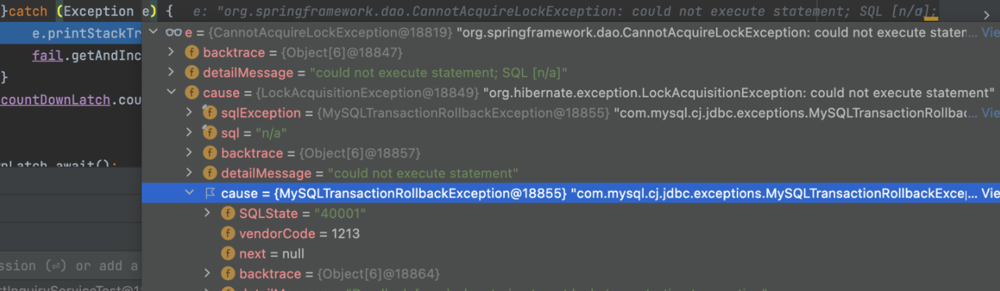

---
title: 외래키로 인한 데드락
date: 2022-02-10
tags:
  - MYSQL
  - LOCK
---  

초기 서비스 운영과정에서 사용자가 얼마 없는 상황임에도 데드락 쿼리가 발생하였다.
데드락 쿼리가 발생한 코드 부분은 교착상태가 발생할 수 있는 조건이 없다고 생각했는데 해당 문제가 발생된게 의아하였다.

MYSQL 공식문서와 여러 블로그내용들을 참고하면서 결론은 양방향이 설정된 상태에서 외래키를 가지고 있는 테이블에 
락이 전파되면서 데드락이 발생되었다.

해당글은 데드락발생 원인을 분석하고 개인적으로 정리한 글이다

##### 1. 배경
게시판과 댓글처럼 다대일 양방향 관계가 맺어져 있었다
```java

@Entity
public class Reply {

    @ManyToOne(fetch = FetchType.LAZY)
    private Post post;

}

@Entity
public class Post {

      @OneToMany(mappedBy = "post", cascade = CascadeType.ALL, orphanRemoval = true)
      private Set<Reply> replies = new HashSet<>();

      @Convert(converter = StepConverter.class)
      private Step step;

}
```
사용자가 글을 올리면, 어떤 역할을 하는 담당자가 답변을 남길 수 있는 상황이다. 그리고 만약 담당자가 답변을 남기게 되면
사용자의 게시글 상태는 최초 게시글을 올린 상태인 `게시글작성`에서 `답변완료`상태로 변경이 된다.
그리고 물리적인 테이블 관계도는 답변테이블에 게시글 id값이 외래키로 설정되어 있었다. 


##### 2. 원인분석
```java
@Entity
public class Post {

    @OneToMany(mappedBy = "post", cascade = CascadeType.ALL, orphanRemoval = true)
    private Set<Reply> replies = new HashSet<>();

    @Convert(converter = StepConverter.class)
    private Step step;

    public Reply addReply(Admin admin, String answer) {
        this.step = STEP.REPLY_COMPLETED;
        Reply reply = Reply.builder()
            .writer(admin.getId())
            .post(this)
            .answer(answer)
            .build();
        this.replies.add(reply);
    return reply;    

    //.. 생략
}

@Service
public class PostService {

    private final postRepository postRepository;

    @Transactional
    public void addReply(Admin admin, String answer, Long postId) {
       Post post = postRepository.findById(postId);     
       post.addReply(admin, answer);
    }
}
```
데드락 쿼리가 발생한 부분이 위와 같은 코드로 되어있었다. 
위의 코드는 총 3번의 쿼리가 순차적으로 발생된다
   - 게시글 SELECT 
   - 답변 INSERT
   - 게시글 UPDATE

INSERT, UPDATE 과정에서 쓰기락이 발생할 수 있지만, 트랜잭션이 겹치더라도 커밋이 완료되면 덮어씌우는 형태로
쿼리가 발생하여 문제가 없을텐데 어떤 부분에서 잘못되었는지를 알 수조차 없었다.

로컬에서 문제재현을 위하여 ExecutorService를 이용해 여러쓰레드를 만들어 테스트해보니 동일한 데드락 쿼리가 발생하였다. 

 

해당 로그를 살펴보면 `락을 획득할 수 없어 예외가 발생하였고, 해당 트랜잭션은 롤백되었다`라는 것을 알 수 있다. 
로컬환경에서 디버깅모드로도 찾기가 어려워 이것저것 찾아보다가 mysql cli로 `SHOW ENGINE INNODB STATUS` 명령어를 수행하면
최근 발생된 데드락로그를 확인할 수 있었다. 
```shell
------------------------
LATEST FOREIGN KEY ERROR
------------------------
2022-02-07 01:55:58 0x40e6538700 Error in foreign key constraint of table post/#sql-1_40:
 foreign key (post_id) references post:
Syntax error close to:

------------------------
LATEST DETECTED DEADLOCK
------------------------
2022-02-07 01:57:05 0x4163d9a700
*** (2) TRANSACTION:
TRANSACTION 1, ACTIVE 0 sec starting index read
mysql tables in use 1, locked 1
5 lock struct(s), heap size 1136, 2 row lock(s), undo log entries 1
MySQL thread id 67, OS thread handle 280848082688, query id 2621 172.17.0.1 root updating
update post set step=2 WHERE id = 1
*** (2) HOLDS THE LOCK(S):
RECORD LOCKS space id 4338 page no 3 n bits 72 index PRIMARY of table `example`.`post` trx id 1 lock mode S locks rec but not gap
Record lock, heap no 2 PHYSICAL RECORD: n_fields 15; compact format; info bits 0

*** (2) WAITING FOR THIS LOCK TO BE GRANTED:
RECORD LOCKS space id 4338 page no 3 n bits 72 index PRIMARY of table `example`.`post` trx id 1 lock_mode X locks rec but not gap waiting
Record lock, heap no 2 PHYSICAL RECORD: n_fields 15; compact format; info bits 0

// 생략...
*** WE ROLL BACK TRANSACTION (2)
------------
TRANSACTIONS
------------
```
- `LATEST FOREIGN KEY ERROR` : 외래키 데이터 정합성 체크 중 발생된 에러인것을 확인 
- `WAITING FOR THIS LOCK TO BE GRANTED` : Lock을 선점하기 위해 대기중인 데이터 정보
- `HOLDS THE LOCK` : 현재 확보 중인 Lock에 대한 정보 

위에 로그에서 데드락이 발생된 원인은 S락을 획득한 상태에서 게시판 상태 업데이트를 위해 X락을 획득을 시도한다. 
X락을 선점하기 위해서는 상대방이 가지고 있는 S락이 해제되어야 X락을 획득할 수 있으나, 
계속 상대방 트랜잭션이 S락을 선점하고 있어 데드락이 발생된걸로 확인된다.

여기서 이해가 안됬던 부분은 총 3가지이다. 데드락 개념, S락에 대한 이해, S락 발생 원인

1. 데드락 개념 
- 기존에 이해하고 있었던 데드락은 순환교착 데드락(Cycle DeadLock)이라는 것을 알게되었다.   
- 순환교착 데드락 : 두 세션이 필요로 하는 리소스를 얻기 위해 서로 상대방이 Lock을 풀기를 기다리는 상태  
- 변환 교착(Conversion DeadLock) : 같은 대상에 대해 둘 이상의 세션이 동시에 잠금을 변경하려고 할 때 발생  
이번에 발생된 데드락으니 변환교착 데드락에 해당된다고 볼 수 있다. 

2. S락(공유락)에 대한 이해
 - 공유락은 읽기잠금이라고도 하며 데이터 항목을 읽는데만 사용  
 - 여러 세션에서 동일한 자원에 대한 공유락 획득이 가능함  
 - 다른 세션에서 업데이트를 하지 못하도록 하는데 목적이 있음  
 - 공유락이 획득한 상태에서 다른 트랜잭션이 데이터를 변경할 수 없음(공유락은 다른 트랜잭션에서의 X락(=쓰기락)을 허용하지 않음)
 - S락, X락 호환성
   v. T1이 S락을 선점하였다면, T2도 동일한 데이터에 S락 선점 가능  
   v. T1이 S락을 선점하였다면, T2는 동일한 데이터에 X락 선점 못함  
   v. T1이 X락을 선점하였다면, T2는 동일한 데이터에 S락 선점 못함   
   v. T1이 X락을 선점하였다면, T2는 동일한 데이터에 X락 선점 못함 

3. S락 발생이유
 - 일반적인 SELECT 쿼리에서는 발생 안됨  
 - `SELECT ... LOCK IN SHARE MODE` 구문을 사용할 때  
 - 행을 삽입, 삭제 또는 업데이트하는 쿼리에서 외래키 제약조건은 행 단위로 확인이 되는데, 
 외래키 검사를 수행할때 InnoDB는 연관된 테이블 레코드에 대해 공유락을 설정한다
 [MYSQL-외래키 락관련](https://dev.mysql.com/doc/refman/5.7/en/ansi-diff-foreign-keys.html)


위의 분석된 내용을 정리해보면 답변 레코드를 INSERT 후 게시글 상태를 UPDATE 과정에서
답변 테이블에 있는 외래키 제약조건으로 부모테이블인 게시글 레코드에 공유락이 설정되고, 
트랜잭션이 겹친 상황에서 여러 트랜잭션은 공유락을 같이 선점할 수 있지만, 게시글 레코드를 업데이트하기 위해 X락 선점을 하려면
상대방이 가지고 있는 공유락이 해제되어야 X락을 획득할 수 있으나, 서로가 S락 해제를 대기하게 되어 데드락이 발생된걸로 확인되었다.

4. 해결방안
 외래키를 삭제한다