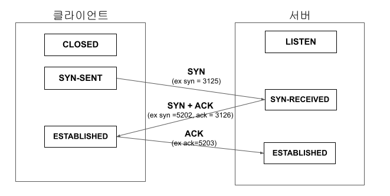

---
title: TCP/IP 핸드쉐이크 (작성중)
date: 2021-04-15
tags:
  - Network
---  

TCP/IP는 연결지향 프로토콜이다. 양 종단간의 논리적으로 접속 가능한 상태로 만든 뒤 서버와 클라이언트는
지속적인 통신을 할 수 있게 된다. 

해당 포스트에서는 TCP/IP의 `접속가능상태`로 만드는 3-handshake와 `접속 종료`로 만드는 4-handshake에 대해
살펴보고, 이 과정을 통해 TCP/IP가 의미하는 `연결지향 프로토콜`이 무엇인지 알아보도록 하겠다. 

#### 

##### 3-핸드쉐이크 과정

클라이언트와 서버간의 접속가능 상태를 만들기 위해서 서버와 클라이언트는 3-핸드쉐이크 과정을 거친다. 핸드쉐이크 과정을 
거치기전에 우선 클라이언트는 서버의 IP주소를 알아야 핸드쉐이크 요청이 가능하다.  

클라이언트는 DNS 서버를 통해 IP주소를 조회하고 클라이언트의 TCP Header에 송,수신처에 대한 IP와 포트번호 값을 넣음으로써, 
3-핸드쉐이크 과정을 시작할 준비단계를 마친다.  

이제 어떻게 서버와 클라이언트간의 3-핸드쉐이크 과정이 진행되는지 살펴보겠다. 

1) 클라이언트는 서버로 SYN 비트를 보낸다.
2) 서버는 클라이언트로 받은 SYN비트에 승인비트인 ACK비트를 더한 값을 클라이언트로 다시 보낸다.
3) 클라이언트는 서버로부터 받은 ACK비트를 다시 서버로 보낸다. 

##### 4-핸드쉐이크 과정

[Refference]
- 성공과 실패를 결정하는 1%의 네트워크 원리
- (https://tools.ietf.org/html/rfc793) RFC 문서

