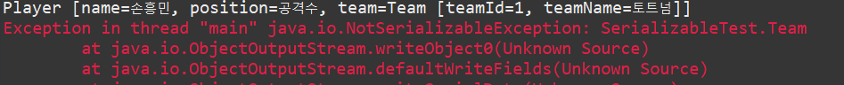

```
Member [name=김동환, email=abc@study.com, age=31, iq=100.0, address=null]
```

**3) 객체 그래프 관계** 

 클래스 데이터 타입을 참조하고 있는 객체를 직렬화할 경우 `transient` 키워들 사용하여 제외하거나 
 혹은 참조하고 있는 클래스 데이터 타입도 `Serializable` 인터페이스를 구현해줘야 한다.

 ```java
 public class Player implements Serializable{
	private static final long serialVersionUID = 4906028383324707764L;
	private String name;
	private String position;
	private Team team; 
}

public class Team {
	private String teamId;
	private String teamName;
}
 ```

 ```java
public static void main(String[] args) throws Exception{
		
    File file = new File("D:\\team.txt");
    Team team = new Team("1", "토트넘");
    Player player = new Player("손흥민","공격수", team);
	
    System.out.println(player);
    ObjectOutputStream oos = new ObjectOutputStream(new FileOutputStream(file));
	 
    oos.writeObject(player);
    oos.close();
}
 ```
 
 
위의 예외는 Team 클래스에 Serializable 인터페이스를 구현하지 않아 예외가 발생하였다.

**4) 버그나 보안에 취약**  

`readObject` 메서드는 바이트 스트림을 인자로 받아 인스턴스를 생성하는 방식이다.   
(일반적인 `new` 키워드를 사용하는 방식이 아니다)  
그래서 클래스의 생성자가 private이건 protected건 상관없이 직렬화 클래스는 
readObject 메소드를 사용하는 순간 public 생성 방식이 되어버린다.  
결국, 이러한 특이한(?) 객체 생성 방식은 생성자에 유효성 검사 로직이 들어가더라도
수행하지 못하여 버그나 보안에 취약한 구조를 갖게 된다.

(아래의 예제부터는 Effective Java2 책 내용을 기반으로 하여 정리하였다)
```java
public final class Period implements Serializable{
 
    private final Date start;
    private final Date end;
	
    public Period(Date start, Date end) {
		this.start = new Date(start.getTime());
		this.end = new Date(end.getTime());
		if (this.start.compareTo(this.end) > 0)
			throw new IllegalArgumentException(start + " after " + end);
	}

    public Date start() {return new Date(start.getTime());}
    public Date end() {return new Date(end.getTime());}
    public String toString() {return start + " - " + end;}
    
    // 생략
}
```

생성자에 시작일과 종료일을 비교하여 올바른 값을 안넣었을 경우 예외를 발생하는 유효성검사를
하는 부분이 있다. 일반적인 `new` 키워드를 사용할 경우, 위의 유효성 검사를 수행하지만 역직렬화를
할 경우에는 위의 유효성 검사를 수행하지 않는 문제가 발생한다.

`readObject`가 바이트 스트림을 인자로 받아서 생성하기 때문에 클래스의 
불변식을 위반하는 객체를 만들 수 있게 된다.

이러한 문제를 해결하기 위해서는 `defaultReadObject` 메서드를 호출하는 
readObject메소드를 Period 클래스에 구현해서 역직렬화된 객체의 유효성을 검사하도록 해야한다.

기본적인 serializable 구현 이외에 추가적인 옵션사항들을 넣으려면 `readObject`나 `writeObject`를 
직렬화 가능 클래스 내부에 메서드를 정의하면 사용자 정의 직렬화가 가능하다.


```java
public final class Period implements Serializable{

	private final Date start;
	private final Date end;

	public Period(Date start, Date end) {
		this.start = new Date(start.getTime());
		this.end = new Date(end.getTime());
		if (this.start.compareTo(this.end) > 0)
			throw new IllegalArgumentException(start + " after " + end);
	}

	public Date start() {return new Date(start.getTime());}

	public Date end() {return new Date(end.getTime());}

	public String toString() {return start + " - " + end;}
	
  //유효성을 검사하는 readObject메서드
	private void readObject(ObjectInputStream s)throws Exception{
		
		System.out.println("readObject Come in");
		
        s.defaultReadObject();
  	
		if(start.compareTo(end)>0)
			throw new InvalidObjectException(start + " after "+ end);
	}
}
```
`defaultReadObject`는 현재 스트림에 있는 클래스의 `non-static`, `non-filed`를 읽어들인다. 이렇게 먼저
읽어들인 필드를 바로 아래의 `if`문에서 읽어들여 유효성 검사를 하여 좀 더 안정적인 직렬화 가능 클래스를 설계할 수 있다.

---
### 5. 정리
> 클래스를 배포하고 나면 클래스 구현을 유연하게 바꾸기가 어렵다

위의 문구는 이펙티브 자바에 나오는 내용이다. 이번에 직렬화에 대해 조사하고 정리하면서 위의 대목이 가장
와닿은 내용이었다. 

직렬화 구현 자체는 얼핏보면 쉬어보이지만, 유지보수 관점에서 바라볼 때 애초에 직렬화 설계를 잘 해놔야
문제 발생소지를 줄일 수 있을 거라는 생각이 든다. 

---


### [Refference]
- Effective Java 2판
- http://woowabros.github.io/experience/2017/10/17/java-serialize.html
- https://okky.kr/article/224715
- https://devbox.tistory.com/entry/Java-%EC%A7%81%EB%A0%AC%ED%99%94 
- https://brunch.co.kr/@oemilk/179
- https://aroundck.tistory.com/3114