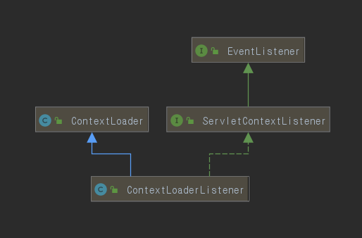
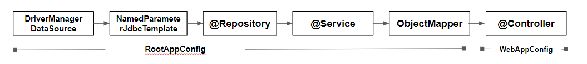

### 2. ServletContext 설정 
Servlet 3.0 이상부터는 xml대신 Java 코드로 Web과 관련된 설정이 가능하다.
Spring에서는 web 설정을 지원 해줄 수 있는 몇 개의 인터페이스를 제공한다. 
그 중에서 좀 더 Servlet 설정에 직관적으로 보이는 `WebApplicationInitializer`를 선택하였다.
 

```java
 public class ServletInitConfig implements WebApplicationInitializer {
 
     @Override
     public void onStartup(ServletContext container) {
 
         //① RootApplicationContext 생성 및 설정정보 등록
         AnnotationConfigWebApplicationContext rootContext = new AnnotationConfigWebApplicationContext();
         rootContext.register(RootAppConfig.class);
 
         //② RootApplicationContext 라이프사이클 설정
         container.addListener(new ContextLoaderListener(rootContext));
 
         //③ WebApplicationContext 생성 및 설정정보 등록
         AnnotationConfigWebApplicationContext dispatcherContext = new AnnotationConfigWebApplicationContext();
         dispatcherContext.register(WebAppConfig.class);
 
         //④ DispatcherServlet 생성 및 기타 옵션정보 설정
         ServletRegistration.Dynamic dispatcher = container.addServlet("dispatcher", new DispatcherServlet(dispatcherContext));
         dispatcher.setLoadOnStartup(1);
         dispatcher.addMapping("/");
        
     }
}
```
 `WebApplicationInitializer` 인터페이스를 구현하면 onStartup 메서드가 만들어진다. `onStartup`은 
 ServletContext타입의 변수를 파라미터로 받아 Servlet container를 초기화하는 메서드이다.
 
 (여기서, onStartUp메서드의 ServletContext 파라미터는 SpringServletContainerInitializer[SPI]라는 이 API가 자동으로 감지하여
  컨테이너에 부트스트랩 하여 파라미터를 넘겨준다)

Annotation 기반으로 설정을 하기 때문에 `AnnotationConfigWebApplicationContext` 타입으로 설정을 진행하였다.


##### ① RootApplicationContext 생성 및 설정정보 등록  

~~~java
@Configuration
@ComponentScan(basePackageClasses = {MysqlConfig.class, MemberRepository.class, MemberService.class})
public class RootAppConfig {

  @Bean
  public ObjectMapper objectMapper(){
      return new ObjectMapper();
  }
}
~~~

 RootApplicationContext에 등록된 Bean들에 대한 설정코드이다. 
 ComponentScan을 사용하여 Service, Repository, DB설정정보들을 rootContext 변수에 등록하였다.


##### ② RootApplicationContext 라이프사이클 설정  

 1번의 설정정보가 담긴 rootContext를 ServletContext의 addListener메서드를 통해 ContextLoaderListener인스턴스 생성자 
 파라미터로 담아 등록하였는데 이 부분이 어떻게 라이프사이클을 결정짓는지 확인해보자.



~~~java
public class ContextLoaderListener extends ContextLoader implements ServletContextListener {
    public ContextLoaderListener() {
    }

    public ContextLoaderListener(WebApplicationContext context) {
        super(context);
    }

    public void contextInitialized(ServletContextEvent event) {
        this.initWebApplicationContext(event.getServletContext());
    }

    public void contextDestroyed(ServletContextEvent event) {
        this.closeWebApplicationContext(event.getServletContext());
        ContextCleanupListener.cleanupAttributes(event.getServletContext());
    }
} 
~~~

ContextLoaderListener는 ServletContextListener 인터페이스의 구현체이자 ContextLoader 클래스를 상속한 클래스이다.
상위 인터페이스로 강제 구현한 `contextInitialized`와 `contextDestroyed` 두 개의 메서드를 통해 라이프 사이클을 컨트롤한다.

위의 클래스다이어그램에서 EventListener 인터페이스가 있는데, 이 인터페이스는 구현체가 없는 마커 인터페이스이다. 
ServletContext의 addListener 메서드를 확인해보면 EventListener 타입의 인자값을 받는것을 확인 할 수 있다.

RootApplicationContext의 eventlistener 설정을 통해 라이프사이클 설정을 한 이유는 컨테이너 생성 시에는 
RootContext를 생성해야 Bean들을 사용할 수 있으며, Destoryed될 때에는 메모리해제를 위해 정상적으로 종료가 되야하기 때문이다.


##### ③ WebApplicationContext 생성 및 설정정보 등록
~~~java
@Configuration
@EnableWebMvc
@ComponentScan(basePackageClasses = MemberController.class)
public class WebAppConfig implements WebMvcConfigurer {

}
~~~
@EnableWebMvc 어노테이션은 Spring의 기본설정들을 담고 있다. (MessageConverter나 ViewResolvers 등 ..) 
추가로 Controller를 스캔하여 SpringMVC 구조의 Bean들을 설정할 수 있다.

##### ④ DispatcherServlet 생성 및 기타 옵션정보 설정

 ServletContainer에 DispatcherServlet을 생성 후, setLoadOnStartup 부분을 볼 수가 있다. 
 서블릿은 서버가 올라가게 되면, 최초 request 요청이 들어올 때 초기화가 되는데, 이럴 경우 처음 사용자는 서비스에 불편을 겪게된다. 
 그래서 서버가 스타트되면 초기화 과정이 이루어질 수 있도록 setLoadOnStartup 메서드를 사용한다. (숫자가 0과 같거나 클 경우 해당)

 
동작방식은 ServletContext가 초기화 단계 동안 ServletContextListener 객체의 contextInitialized 메서드를 호출하여
Servlet을 인스턴스화하고 초기화한다. (ContedxtLoaderListener 클래스다이어그램 참고)
---  

### 3. 의존성 주입 순서

위에 설정된 Spring환경을 디버깅 모드로 테스트 해보면 아래의 그림과 같은 의존성 주입 순서가 나온다.



WebApplicationContext는 RootApplicationContext의 Bean들을 필요하기에 RootApplicationContext에 설정된 Bean들을 
먼저 생성 후에 WebApplicationContext Bean들을 생성 및 주입하는 순서가 된다.

그렇다면, 두 Context간의 상속구조와 Bean 주입순서를 Spring이 어떻게 만들어넀는지 궁금하기도 하였고, @Repository -> @Service의 Bean 주입 순서는 어떻게 결정했는지도 궁금하였다. 그래서 클래스 다이어그램이랑 인터넷에서 이것저것 찾아봤는데 이 부분은 나의 실력 및 분석 부족으로 인해 다루지 못하였다.

 대략 찾아본 결과는 BeanPostProcessor가 Bean 생명주기에 관여하여 Bean이 필요한 순서를 처리한다고 한다.(정확한건 아닙니다.) 아쉽지만, 추상적인 정리로 Bean 의존관계에 대한 순서를 Spring이 보장한다는 것이고, 이거에 대한 특별한 API가 관여하여 처리한다고 결론을  내리기로 했다.

또한, RootContext는 WebContext에 있는 Bean들에 대한 정보를 가져 올 수 없고, 오로지 WebContext가 RootContext에 있는 Bean들에 접근 할 수 있다는 것이다.

---
### 4. 정리
- Spring은 확장성을 위하여 ApplicationContext를 계층적으로 나누었다. 나눈 기준은 객체지향관점에서 변하는 것과 변하지 않는 
  부분을 나누어 RootApplicationContext와 WebApplicationContext를 분리하였다.
- 기존 xml 방식에서는 해당 클래스가 다른 클래스에 대한 의존도를 찾아보기가 어려웠는데 Java환경으로 구성할 경우, 
  각 클래스별 의존도와 구현에 대한 상세한 부분을 알 수 있었다.
- 마지막으로 설정 오류가 될 경우, 디버깅 모드로 테스트가 가능하기에 좀 더 오류에 대해 대응하기가 쉬웠다.
### [Refference]
- https://spring.io/
- https://www.technicalkeeda.com/spring-tutorials/spring-4-jdbctemplate-annotation-example
- https://www.baeldung.com/spring-xml-vs-java-config
- https://jhgan.tistory.com/40
- https://www.baeldung.com/spring-web-contexts
- https://dzone.com/articles/understanding-spring-web
- https://docs.spring.io/spring/docs/3.2.x/spring-framework-reference/html/mvc.html
